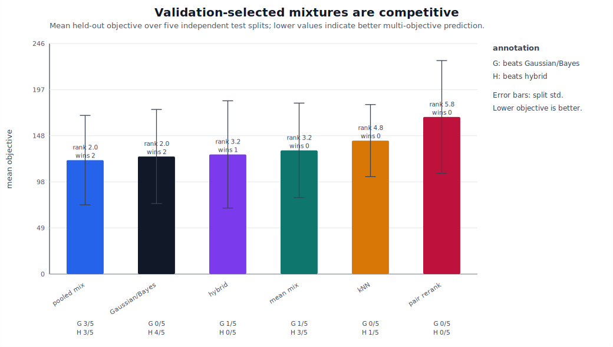
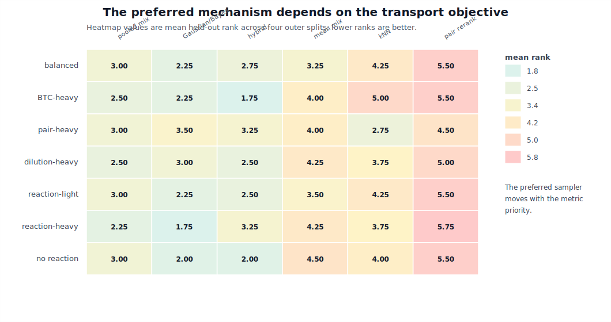
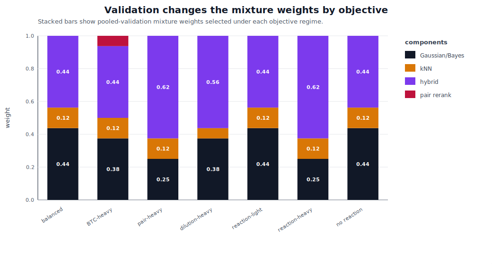
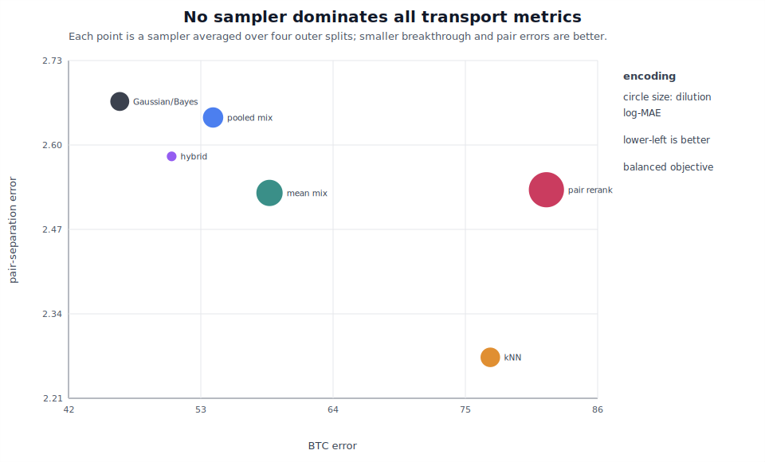
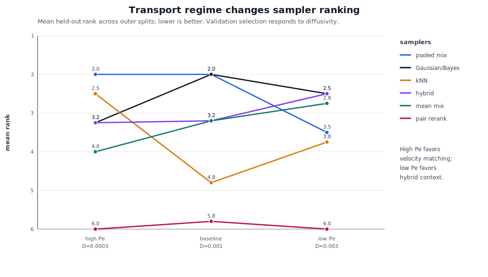
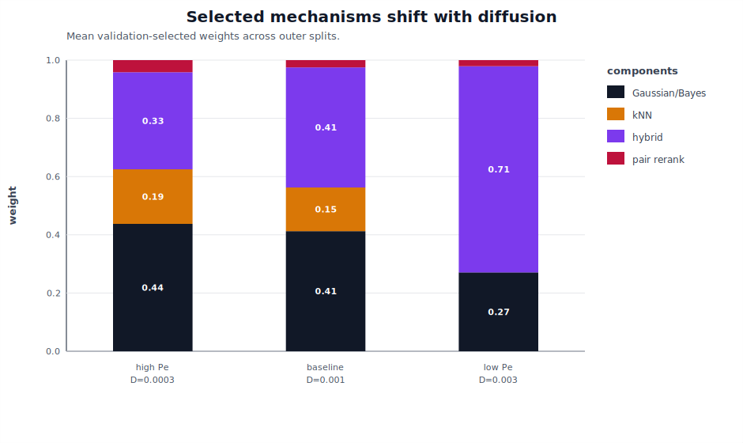
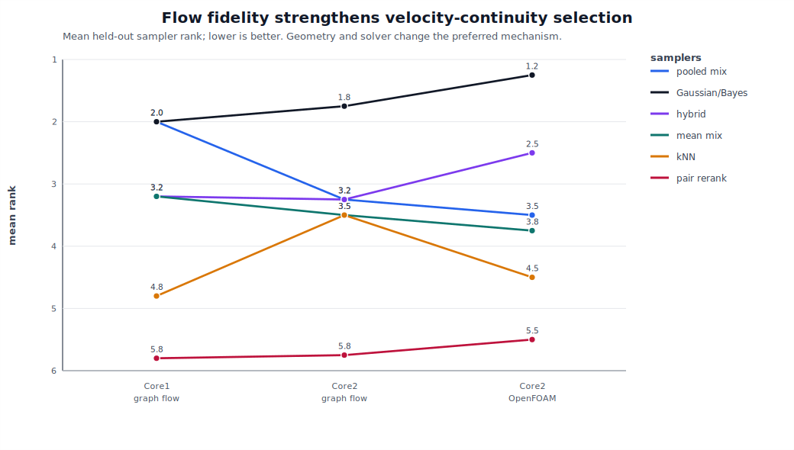
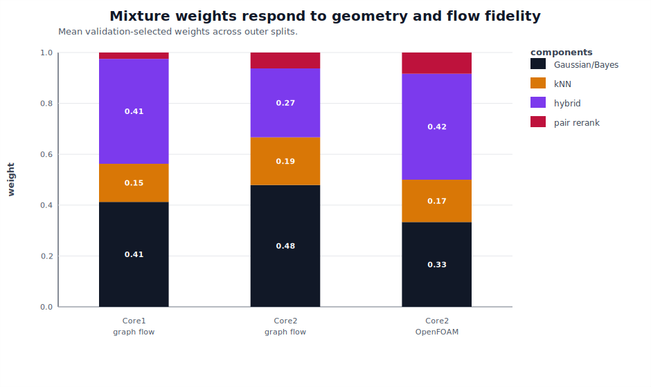
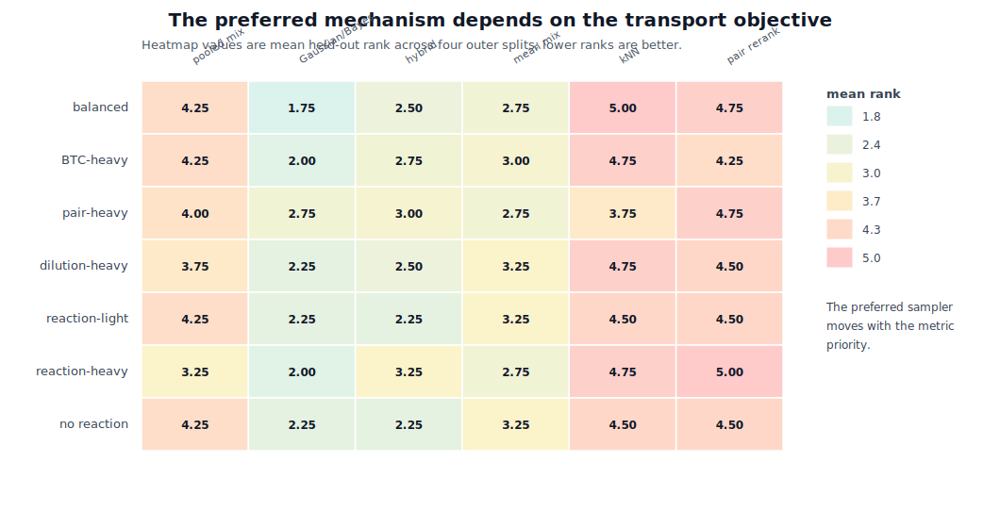

# Validation-Driven Training Trajectories for Non-Fickian Transport in Porous Media

## Authors

Sebastian Most, Diogo Bolster, Branko Bijeljic, Wolfgang Nowak, and collaborators to be determined

## Working Thesis

The 2019 training-trajectory method was already a physics-constrained generative model for Lagrangian transport. The strongest AI-era update is not to replace its physics-informed transition kernel with a black-box learned model, but to expand the family of candidate transition mechanisms and select or weight them by held-out, multi-objective transport validation.

The evidence now supports a sharper claim:

```text
No sampler is universally best. Peclet regime, geometry, flow fidelity, and
scientific objective determine which transition mechanism is preferred.
```

## Abstract

Non-Fickian transport in porous media is controlled by persistent Lagrangian memory: particles remember the pore-scale velocity structures, diffusive exchanges, and spatial organization they have sampled. Continuous time random walks and spatial Markov models have provided powerful descriptions of anomalous breakthrough and dispersion, but reduced-state closures can obscure particle-level information needed for dilution, pair separation, and reaction-relevant encounter statistics. We revisit the training-trajectory approach of Most et al. (2019), which treats resolved particle trajectories as the primitive training data for generating new advective-diffusive paths. In current language, this method is a nonparametric, physics-constrained generative model over trajectory segments.

We introduce a validation-driven extension of training trajectories. Candidate transition samplers include the original Gaussian/Bayes velocity-continuity kernel, k-nearest-neighbor conditional resampling, a learned contrastive hybrid transition rule, pair-aware reranking, and mixtures of these components. Mixture weights are selected using held-out validation trajectories and multi-objective scores based on breakthrough, dilution, pair-separation, and reaction-encounter metrics. Tests on segmented Bentheimer sandstone trajectories show that validation-selected mixtures can be competitive with, and sometimes better than, the strongest fixed sampler, but no component dominates universally. A Peclet-regime sweep shifts selected weights from velocity-matching mechanisms toward learned hybrid context as diffusion increases. A second Bentheimer geometry and an OpenFOAM finite-volume velocity field strengthen the original Gaussian/Bayes kernel, while pair-heavy objectives still favor learned transition context. These results support a methodological conclusion: modern machine learning is most useful here as a disciplined mechanism-selection layer inside a physically constrained Lagrangian generative framework, not as an unvalidated replacement for the physics kernel.

## 1. Introduction

Solute transport in porous and fractured media is often non-Fickian. Breakthrough curves can show early arrival and late-time tailing, plume spreading can remain pre-asymptotic over experimentally relevant distances, and particle velocities can retain memory of the pore-scale structures through which they have traveled. These behaviors motivate transport models that start from Lagrangian particles rather than only from Eulerian concentration closures. Continuous time random walks represent anomalous waiting and transition statistics [Berkowitz2006], while spatial Markov and correlated CTRW models recognize that velocity histories may be more naturally structured in distance than in time [LeBorgne2008a; LeBorgne2008b; Dentz2016; Sherman2021].

The Lagrangian point of view is especially important when the target is more than a breakthrough curve. A breakthrough curve can be approximately correct while dilution, pair separation, or reaction-relevant encounter rates are wrong. In pore-scale transport, the relevant memory is not only scalar velocity correlation; it can include direction changes, local stretching, diffusive exchange across streamlines, and the proximity history of particle pairs. Any upscaled model intended for mixing or reactive transport must therefore preserve more of the particle history than arrival-time statistics alone.

Most et al. (2019) proposed a direct way to retain that information. Instead of estimating a high-dimensional transition matrix over reduced states, they treated resolved particle trajectories as training images for transport. Direct numerical simulation trajectories were cut into short segments, archived, and reassembled into longer synthetic trajectories using transition rules based on velocity continuity and diffusive plausibility. The original method was designed to avoid three common simplifications: reducing finite-Peclet three-dimensional transport to lower-dimensional state spaces, neglecting diffusion in the transition rule, and discarding spatial resolution needed for mixing and reaction metrics [Most2019].

That idea looks different in 2026 than it did in 2019. In modern language, training trajectories are a physics-constrained generative model over Lagrangian path segments. The method has an archive of observed motifs, a transition distribution, and a generation procedure. At the same time, scientific machine learning has matured. Physics-informed machine learning has emphasized constraints, conservation laws, and measurement operators [Raissi2019; Karniadakis2021]. Neural operators have shown how learned maps can approximate families of PDE solutions [Li2021]. Diffusion and score-based models have normalized learned stochastic generation [Song2021]. Porous-media machine learning now includes image-based prediction, surrogate modeling, and generative reconstruction, from GAN-based porous-media reconstruction [Mosser2017] to recent diffusion-based pore-scale image generation [Zhu2025] and broader reviews of data-driven flow and transport methods [Yang2024].

These advances create an opportunity, but also a trap. The opportunity is to learn transition scores, embeddings, uncertainty estimates, or generative segment models that augment the original training-trajectory framework. The trap is to assume that a learned sampler should automatically replace the physics-informed Gaussian/Bayes kernel. For non-Fickian transport, the question is not simply whether a learned model can generate plausible paths. The question is which transition mechanism preserves the transport statistics that matter for a given physical regime and scientific objective.

We therefore frame TTA-v2 as validation-driven physics/ML mechanism selection. The candidate mechanisms are physics-informed kernels, learned transition rules, conditional resamplers, and mixtures. The selection criterion is not visual plausibility or training likelihood, but held-out performance on transport metrics: breakthrough, dilution, pair separation, and reaction-encounter probability. This framing is intentionally modest and testable. It asks modern machine learning to expand the space of mechanisms and expose tradeoffs, not to win a rhetorical contest against physics.

The contributions are:

1. We recast the 2019 training-trajectory method as a physics-constrained Lagrangian generative model.
2. We implement a sampler ladder: unconditional resampling, kNN conditional resampling, the original Gaussian/Bayes transition kernel, learned contrastive hybrid scoring, pair-aware reranking, and validation-selected mixtures.
3. We evaluate generated trajectories using breakthrough, dilution, pair-separation, and reaction-encounter metrics.
4. We show that validation-selected mixtures are competitive with the strongest fixed kernel, but no sampler dominates across held-out splits.
5. We show that selected mechanisms shift with objective weights, Peclet regime, second geometry, and OpenFOAM flow fidelity.
6. We identify the most defensible AI-era claim: learned transition context is valuable when validated against the right objective, while the original physics-informed kernel remains a strong and often dominant component.

## 2. Methods

### 2.1 Training-Trajectory Archive

A resolved particle trajectory is a sequence

```text
x_i(t_0), x_i(t_1), ..., x_i(t_T)
```

in two or three spatial dimensions. Following Most et al. (2019), each trajectory is divided into overlapping segments of length `segment_steps`. For each archived segment, we store the relative path, initial and final positions, and estimates of the starting and ending velocities over a shorter matching window `match_steps`. The archive is therefore a set of local transport motifs that retain pore-scale path structure.

Generation begins from an archive segment and recursively chooses a next segment. The candidate segment is shifted so that its matching point joins the current endpoint, and the overlapping portion is discarded to avoid duplicating time samples. This cut-copy-paste construction preserves observed segment shapes while producing arbitrary-length synthetic trajectories.

### 2.2 Candidate Transition Samplers

We compare six transition mechanisms.

The unconditional sampler draws the next segment uniformly from the archive. It is a memory-destroying baseline. The kNN conditional sampler selects candidate segments whose initial velocity is near the current ending velocity and samples them with distance-weighted probabilities. The Gaussian/Bayes sampler follows the original TTA logic: an interface velocity mismatch is plausible if it can be explained by diffusion over the matching interval, yielding a physically scaled likelihood.

The learned hybrid sampler trains a contrastive transition scorer from observed adjacent archive segments and negative samples. In this prototype, the learned score is combined with the Gaussian/Bayes likelihood rather than used alone. The pair-aware reranking sampler modifies Gaussian/Bayes candidates using archive descriptors intended to preserve short-horizon pair behavior. Finally, a mixture sampler combines transition distributions:

```text
p(next | state) = sum_i w_i p_i(next | state)
```

where weights are selected by validation.

### 2.3 Validation-Driven Mixture Selection

For a fixed archive and a fixed set of component samplers, we search a simplex grid over mixture weights. Each candidate mixture generates a validation ensemble from training-origin initial positions. The generated metrics are compared with a held-out validation ensemble using

```text
J = a_BTC * E_BTC
  + a_pair * E_pair
  + a_dilution * E_dilution
  + a_reaction * E_reaction.
```

Here `E_BTC` is a breakthrough quantile and coverage score, `E_pair` is a pair-separation quantile error, `E_dilution` is a log-error in dilution index, and `E_reaction` is an absolute error in encounter probability.

We use two mixture aggregation rules. The pooled-validation mixture selects the grid point with the best mean validation score across repeated inner splits. The bootstrap-mean mixture averages the best weights selected independently across repeated inner validation splits. The second rule is less aggressive and can act as a regularized summary when validation ensembles are small.

### 2.4 Trajectory Data

The original DNS trajectories from Most et al. (2019) are not available in this workspace, so we use public Bentheimer sandstone micro-CT volumes from the Zenodo multi-resolution Bentheimer dataset. The workflow thresholds pore space, extracts the inlet-outlet connected pore network, computes a velocity field, and tracks advective-diffusive particles.

The first velocity field is a graph-Laplace pressure approximation on the connected pore voxels. It is a bootstrap generator for method development, not a final DNS replacement. The main Core1 volume is `Core1_Subvol1_6micron_225cube_16bit_LE.raw`, downsampled by a factor of three to a `75^3` grid. We generate trajectories at three diffusivities:

```text
high Pe:   D = 0.0003
baseline:  D = 0.001
low Pe:    D = 0.003
```

The second geometry is `Core2_Subvol1_6micron_225cube_16bit_LE.raw`, downsampled the same way. Its connected porosity is `0.23294`, compared with `0.22543` for the Core1 baseline.

For the high-fidelity-flow test, we export the connected Core2 pore voxels as an OpenFOAM finite-volume mesh. Each pore voxel is one hexahedral cell. Pore-solid faces are no-slip walls; inlet and outlet faces are fixed kinematic pressure patches. The OpenFOAM case contains 98,270 cells, passes `checkMesh`, and converges with `simpleFoam` in 103 SIMPLE iterations. The solved velocity field is mapped back onto the connected voxel mask and normalized to the same mean advective speed used in the graph-flow particle tracker.

### 2.5 Evaluation Metrics

Generated ensembles are evaluated against held-out reference trajectories using:

- breakthrough quantiles and crossing coverage at multiple control planes,
- dilution index at selected times,
- particle-pair separation quantiles,
- reaction-encounter probability for a fixed encounter radius,
- velocity autocorrelation for direct trajectory-set comparison.

The pair and reaction metrics are included because a sampler can match arrival statistics while corrupting spatial organization, mixing, or encounter structure.

## 3. Results

### 3.1 Validation Mixtures Are Competitive, But Not Universal Winners

The first question is whether validation can combine physics-informed and learned transition mechanisms into a useful generator. In a repeated-validation experiment on the Core1 baseline trajectory set, the bootstrap-mean mixture selected substantial Gaussian/Bayes, kNN, and hybrid contributions:

```text
gaussian_bayes:    0.35
knn_conditional:   0.25
hybrid:            0.35
pair_rerank:       0.05
```

On the held-out split, this mixture achieved the lowest multi-objective score:

```text
sampler                    objective  btc_score  pair_mae  dilution_log  reaction_abs
bootstrap_mean_mixture         84.91      36.64      1.39         0.065         0.013
hybrid                         94.40      43.69      1.42         0.070         0.014
gaussian_bayes                 98.86      41.77      1.68         0.096         0.012
```

The more important test is outer-split robustness. Across five independent held-out test splits, the pooled-validation mixture had the best mean objective and tied Gaussian/Bayes on mean rank. Gaussian/Bayes remained extremely competitive:

```text
sampler                    mean_obj   std_obj  mean_rank  wins  beats_g  beats_h
pooled_validation_mixture    121.64     47.75       2.00     2        3        3
gaussian_bayes               125.48     50.22       2.00     2        0        4
hybrid                       127.71     57.25       3.20     1        1        0
bootstrap_mean_mixture       132.05     50.44       3.20     0        1        3
knn_conditional              142.47     38.49       4.80     0        0        1
pair_rerank                  167.72     60.16       5.80     0        0        0
```

This result sets the tone for the paper. The mixture does not prove that learned components universally beat the physics kernel. It shows that held-out validation can identify useful combinations, and that the original Gaussian/Bayes sampler is a strong baseline rather than a straw man.



**Figure 1. Outer-split robustness of validation-selected samplers.** Mean held-out multi-objective transport error over five independent outer train/test splits. Lower is better.

### 3.2 Scientific Objective Changes the Preferred Mechanism

A single scalar objective is convenient, but it can hide scientific priorities. We therefore repeated selection under seven objective-weight regimes. In the Core1 baseline sensitivity run, Gaussian/Bayes was the most stable mean performer, but the preferred sampler changed with metric priorities:

```text
regime           best_mean_sampler            mean_obj  mean_rank  wins
balanced         gaussian_bayes                 145.26       2.25     1
btc_heavy        gaussian_bayes                 188.73       2.25     0
pair_heavy       knn_conditional                204.41       2.75     0
dilution_heavy   hybrid                         170.07       2.50     2
reaction_light   gaussian_bayes                 140.53       2.25     1
reaction_heavy   gaussian_bayes                  85.75       1.75     1
no_reaction      gaussian_bayes                 140.01       2.00     1
```

The selected mixture weights also moved with the objective. Pair-, dilution-, and reaction-sensitive objectives generally increased the hybrid contribution, while balanced and no-reaction objectives retained substantial Gaussian/Bayes mass.



**Figure 2. Objective-weight sensitivity.** Mean held-out sampler rank under seven objective-weight regimes. Lower rank is better.



**Figure 3. Objective-dependent mixture weights.** Pooled-validation mixture weights selected under each objective regime.

The balanced objective can also be unpacked into a Pareto-style view. No sampler simultaneously minimizes breakthrough, pair-separation, and dilution errors. This is why the validation layer should remain multi-objective rather than being reduced to one canonical scalar score.



**Figure 4. Balanced-objective Pareto tradeoff.** Each point is averaged over four outer held-out splits. Lower-left is better.

### 3.3 Peclet Regime Shifts the Selected Mixture

The Core1 Peclet sweep tests whether the selected mechanism is tied to one transport condition. We regenerated trajectories at `D = 0.0003`, `D = 0.001`, and `D = 0.003` on the same geometry and graph-flow field. Mean selected weights shifted systematically:

```text
condition          Gaussian/Bayes   kNN      hybrid   pair
D = 0.0003             0.4375      0.1875   0.3333   0.0417
D = 0.0010             0.4125      0.1500   0.4125   0.0250
D = 0.0030             0.2708      0.0000   0.7083   0.0208
```

At high Peclet, the pooled-validation mixture remained the best mean-objective sampler and kNN conditional matching became more competitive. At low Peclet, the hybrid sampler became the best mean-objective sampler:

```text
D = 0.0003: pooled mixture mean rank 2.00; kNN mean rank 2.50
D = 0.0010: pooled mixture mean rank 2.00; Gaussian/Bayes mean rank 2.00
D = 0.0030: hybrid mean rank 2.50; Gaussian/Bayes mean rank 2.50
```

This is a mechanistic result. As diffusion increases, strict local velocity matching carries less predictive information, and validation shifts weight toward the learned hybrid transition rule. The selected sampler is therefore not a fixed model choice; it responds to the physical regime.



**Figure 5. Peclet-regime sampler ranks.** Mean held-out sampler rank across high-Peclet, baseline, and low-Peclet trajectory ensembles.



**Figure 6. Peclet-regime selected mixture weights.** Increasing diffusivity shifts weight away from velocity matching and toward hybrid learned context.

### 3.4 Second Geometry and OpenFOAM Flow Strengthen the Physics Kernel

The next test changes the geometry and then the velocity solver. On Core2 graph-flow trajectories, Gaussian/Bayes becomes the best mean sampler:

```text
sampler                    mean_obj   std_obj  mean_rank  wins
gaussian_bayes               255.40     39.43       1.75     2
hybrid                       268.50     38.71       3.25     1
pooled_validation_mixture    269.00     40.17       3.25     0
bootstrap_mean_mixture       272.22     33.19       3.50     1
knn_conditional              273.90     45.61       3.50     0
pair_rerank                  320.67     43.86       5.75     0
```

The selected mixture still uses multiple mechanisms:

```text
Gaussian/Bayes 0.4792, kNN 0.1875, hybrid 0.2708, pair rerank 0.0625
```

The OpenFOAM-derived trajectory set gives a sharper version of the same result. The OpenFOAM voxel case has 98,270 cells, passes `checkMesh`, and converges with `simpleFoam` in 103 iterations. On trajectories generated from this finite-volume velocity field, Gaussian/Bayes wins three of four held-out splits:

```text
sampler                    mean_obj   std_obj  mean_rank  wins
gaussian_bayes               261.39     28.17       1.25     3
hybrid                       273.63     28.38       2.50     1
bootstrap_mean_mixture       285.49     17.76       3.75     0
pooled_validation_mixture    299.46     33.33       3.50     0
knn_conditional              311.05     19.82       4.50     0
pair_rerank                  317.19     31.80       5.50     0
```

This is not a problem for the thesis. It is one of the strongest results. The higher-fidelity velocity field makes the original physics-informed Gaussian/Bayes kernel more valuable, which confirms that the 2019 transition logic still captures real transport structure.



**Figure 7. Geometry and flow-fidelity sampler ranks.** Mean held-out sampler rank for the Core1 graph-flow baseline, Core2 graph-flow trajectories, and Core2 OpenFOAM-derived trajectories.



**Figure 8. Geometry and flow-fidelity selected mixture weights.** The selected mechanism shifts with geometry and velocity-field fidelity.

### 3.5 Why OpenFOAM Changes the Ranking

The direct Core2 graph-flow versus OpenFOAM comparison explains why Gaussian/Bayes becomes stronger. Both trajectory sets were normalized to the same mean advective speed, so differences are not just bulk-speed changes. OpenFOAM produces a slightly fatter high-displacement tail and slightly larger downstream spread:

```text
quantity                         graph flow      OpenFOAM
mean step displacement              0.0553         0.0561
median step displacement            0.0519         0.0519
95th percentile displacement        0.1060         0.1111
99th percentile displacement        0.1481         0.1664
max step displacement               0.4452         0.5577
final x q90                        25.4449        27.2591
```

OpenFOAM also increases dilution and slightly increases late-time pair separation:

```text
metric                         graph flow       OpenFOAM
dilution at t=100               5365.76          5588.79
dilution at t=400               7502.76          7959.51
pair median at t=100              32.76            32.71
pair median at t=400              34.40            34.70
reaction probability               0.0170           0.0168
```

The most important difference is velocity memory. OpenFOAM has higher axial velocity autocorrelation at every checked lag:

```text
lag    graph flow    OpenFOAM
1        0.3152       0.3577
2        0.3079       0.3489
5        0.2878       0.3284
10       0.2609       0.3029
20       0.2269       0.2662
40       0.1785       0.2144
80       0.1293       0.1521
```

This is exactly the condition under which a velocity-continuity transition kernel should be useful. The OpenFOAM field gives the Gaussian/Bayes sampler a stronger physically meaningful signal to condition on.


**Figure 9. Core2 graph flow versus OpenFOAM speed and breakthrough.** Step-displacement quantiles and breakthrough quantiles from the two Core2 reference trajectory sets.


**Figure 10. Core2 graph flow versus OpenFOAM mixing and memory.** Dilution, pair separation, velocity autocorrelation, and reaction-encounter probability.

### 3.6 Pair-Heavy OpenFOAM Objectives Still Favor Learned Context

The OpenFOAM objective-weight sensitivity run prevents the high-fidelity result from becoming too simple. Gaussian/Bayes is the best mean sampler in six of seven objective regimes, but the pair-heavy regime selects the hybrid sampler:

```text
regime           best_mean_sampler            mean_obj  mean_rank  wins
balanced         gaussian_bayes                 303.63       1.75     1
btc_heavy        gaussian_bayes                 554.80       2.00     1
pair_heavy       hybrid                         281.13       3.00     1
dilution_heavy   gaussian_bayes                 370.49       2.25     1
reaction_light   gaussian_bayes                 297.33       2.25     1
reaction_heavy   gaussian_bayes                 169.32       2.00     2
no_reaction      gaussian_bayes                 296.63       2.25     1
```

The pair-heavy result is important. It shows that higher-fidelity flow does not erase the value of learned transition context. It clarifies where learned context matters: not as a universal replacement for physics, but as a mechanism that can improve specific spatial organization metrics.



**Figure 11. OpenFOAM objective sensitivity.** Gaussian/Bayes is most stable overall, while the pair-heavy regime favors the hybrid sampler.

### 3.7 Master Evidence Summary

The current evidence is summarized in one table:

```text
condition        best mean sampler          mean_obj  mean_rank  selected weights (G, kNN, H, pair)
Core1 high Pe    pooled_validation_mixture    276.15      2.00   0.438, 0.188, 0.333, 0.042
Core1 baseline   pooled_validation_mixture    121.64      2.00   0.413, 0.150, 0.413, 0.025
Core1 low Pe     hybrid                       243.53      2.50   0.271, 0.000, 0.708, 0.021
Core2 graph      gaussian_bayes               255.40      1.75   0.479, 0.188, 0.271, 0.063
Core2 OpenFOAM   gaussian_bayes               261.39      1.25   0.333, 0.167, 0.417, 0.083
```


**Figure 12. Master evidence matrix.** Across Peclet regime, geometry, and flow fidelity, no sampler wins universally. The selected mechanism changes with the physical regime and objective.

## 4. Discussion

The main result is not that a learned model beats the original physics kernel. The main result is that training trajectories provide a natural scaffold for validation-driven physics/ML mechanism selection. The original Gaussian/Bayes transition kernel remains hard to beat, especially when the velocity field has stronger physical memory. Learned transition context becomes important under objectives that emphasize pair organization, dilution, or other statistics not reducible to breakthrough alone.

This shifts the story from replacement to selection. A black-box learned sampler might look more modern, but it would obscure a key fact: different mechanisms preserve different transport statistics. The validation layer makes those tradeoffs visible. It allows the model to say, in effect, that a velocity-continuity physics kernel is best for one regime, a learned contextual sampler is better for another objective, and a mixture is appropriate when the target metrics are complementary.

This is especially relevant for reactive transport. Reaction opportunity depends on spatial organization and encounter history, not only arrival times. The pair-heavy OpenFOAM result is therefore not a small technical exception. It is evidence that learned context can matter exactly where classical breakthrough-focused calibration may be insufficient.

The OpenFOAM result also changes how we should present the 2019 method. Rather than describing Gaussian/Bayes as an old baseline to be beaten, we should treat it as a strong physics-informed component. Its success under OpenFOAM is an asset. It shows that the original method encoded useful interface physics, and that modern ML should build around that structure rather than discard it.

### Limitations

This is still a methods and proof-of-concept paper, not a complete cross-lithology validation study. The graph-flow trajectory sets use an approximate pressure solver and simple voxel particle tracker. The OpenFOAM validation uses a stair-step voxel mesh at `75^3`, not a smoothed high-resolution DNS or LBM calculation. The second geometry is another Bentheimer subvolume, not a different rock type. The learned transition model is intentionally lightweight and does not yet use a geometry-conditioned sequence model, diffusion segment generator, or calibrated uncertainty model.

These limitations do not invalidate the thesis, but they set the boundary of the claim. The supported claim is that validation-driven training trajectories can expose and select among physics and learned transition mechanisms across several controlled conditions. The unsupported claim would be that the present implementation is a final universal pore-scale transport simulator.

### Next Steps

The strongest next physical validation would be one of:

- a less-downsampled OpenFOAM case,
- a smoothed `snappyHexMesh` OpenFOAM workflow,
- an LBM or GeoChemFoam velocity field,
- a cross-lithology dataset with comparable particle trajectories.

The strongest next ML step would be a more expressive learned transition rule while keeping the same validation protocol:

- geometry-conditioned segment embeddings,
- a neural transition scorer over short histories,
- a diffusion or flow model for segment generation,
- archive-support diagnostics to detect extrapolative generated paths.

The validation protocol should not change. Stronger learned models should compete against the same physics kernels under the same held-out multi-objective metrics.

## 5. Conclusions

The 2019 training-trajectory method anticipated a central idea of modern scientific generative modeling: resolved examples can be recombined under physical constraints to generate new dynamics. Reopening the idea in the AI era does not require replacing the physics-informed transition kernel. The evidence here suggests the opposite. The original Gaussian/Bayes kernel remains a strong and often dominant component, especially under higher-fidelity OpenFOAM flow.

Modern machine learning adds value when it is used to learn complementary transition context and, more importantly, when it is embedded in a validation-driven framework that can select the right mechanism for the physical regime and scientific objective. Across Peclet regimes, a second geometry, OpenFOAM flow, and objective-weight sweeps, no sampler wins universally. That is not a weakness. It is the reason validation-driven mechanism selection is needed.

## Acknowledgments

Placeholder for data sources, software, and funding. The current prototype uses the Zenodo multi-resolution Bentheimer sandstone image data and locally developed NumPy, OpenFOAM, and trajectory-generation scripts.

## Data and Code Availability

Current code, processed trajectories, run outputs, and SVG figures are organized in this workspace. Before submission, archive the exact scripts, processed trajectory data, JSON outputs, OpenFOAM case configuration, and figure-generation workflow with a DOI-bearing repository.

## Supporting Run Notes

- `docs/run_009_peclet_sweep.md`
- `docs/run_010_second_geometry_openfoam.md`
- `docs/run_011_openfoam_objective_sensitivity.md`
- `docs/run_012_core2_flow_physics_comparison.md`
- `docs/master_evidence_table.md`

## References

[Berkowitz2006] Berkowitz, B., Cortis, A., Dentz, M., & Scher, H. (2006). Modeling non-Fickian transport in geological formations as a continuous time random walk. Reviews of Geophysics, 44. https://doi.org/10.1029/2005RG000178

[Bijeljic2006] Bijeljic, B., & Blunt, M. J. (2006). Pore-scale modeling and continuous time random walk analysis of dispersion in porous media. Water Resources Research, 42. https://doi.org/10.1029/2005WR004578

[Dentz2016] Dentz, M., Kang, P. K., Comolli, A., Le Borgne, T., & Lester, D. R. (2016). Continuous time random walks for the evolution of Lagrangian velocities. Physical Review Fluids, 1, 074004. https://doi.org/10.1103/PhysRevFluids.1.074004

[Karniadakis2021] Karniadakis, G. E., Kevrekidis, I. G., Lu, L., Perdikaris, P., Wang, S., & Yang, L. (2021). Physics-informed machine learning. Nature Reviews Physics, 3, 422-440. https://doi.org/10.1038/s42254-021-00314-5

[LeBorgne2008a] Le Borgne, T., Dentz, M., & Carrera, J. (2008). Lagrangian statistical model for transport in highly heterogeneous velocity fields. Physical Review Letters, 101, 090601. https://doi.org/10.1103/PhysRevLett.101.090601

[LeBorgne2008b] Le Borgne, T., Dentz, M., & Carrera, J. (2008). Spatial Markov processes for modeling Lagrangian particle dynamics in heterogeneous porous media. Physical Review E, 78, 026308. https://doi.org/10.1103/PhysRevE.78.026308

[Li2021] Li, Z., Kovachki, N., Azizzadenesheli, K., Liu, B., Bhattacharya, K., Stuart, A., & Anandkumar, A. (2021). Fourier neural operator for parametric partial differential equations. International Conference on Learning Representations. https://arxiv.org/abs/2010.08895

[Mosser2017] Mosser, L., Dubrule, O., & Blunt, M. J. (2017). Reconstruction of three-dimensional porous media using generative adversarial neural networks. Physical Review E, 96, 043309. https://doi.org/10.1103/PhysRevE.96.043309

[Most2019] Most, S., Bolster, D., Bijeljic, B., & Nowak, W. (2019). Trajectories as training images to simulate advective-diffusive, non-Fickian transport. Water Resources Research, 55, 3465-3480. https://doi.org/10.1029/2018WR023552

[Raissi2019] Raissi, M., Perdikaris, P., & Karniadakis, G. E. (2019). Physics-informed neural networks: A deep learning framework for solving forward and inverse problems involving nonlinear partial differential equations. Journal of Computational Physics, 378, 686-707. https://doi.org/10.1016/j.jcp.2018.10.045

[Sherman2021] Sherman, T., Engdahl, N. B., Porta, G., & Bolster, D. (2021). A review of spatial Markov models for predicting pre-asymptotic and anomalous transport in porous and fractured media. Journal of Contaminant Hydrology, 236, 103734. https://doi.org/10.1016/j.jconhyd.2020.103734

[Song2021] Song, Y., Sohl-Dickstein, J., Kingma, D. P., Kumar, A., Ermon, S., & Poole, B. (2021). Score-based generative modeling through stochastic differential equations. International Conference on Learning Representations. https://openreview.net/forum?id=PxTIG12RRHS

[Yang2024] Yang, G., Xu, R., Tian, Y., Guo, S., Wu, J., & Chu, X. (2024). Data-driven methods for flow and transport in porous media: A review. International Journal of Heat and Mass Transfer, 235, 126149. https://doi.org/10.1016/j.ijheatmasstransfer.2024.126149

[Zhu2025] Zhu, L., Bijeljic, B., & Blunt, M. J. (2025). Diffusion model-based generation of three-dimensional multiphase pore-scale images. Transport in Porous Media, 152. https://doi.org/10.1007/s11242-025-02158-4
