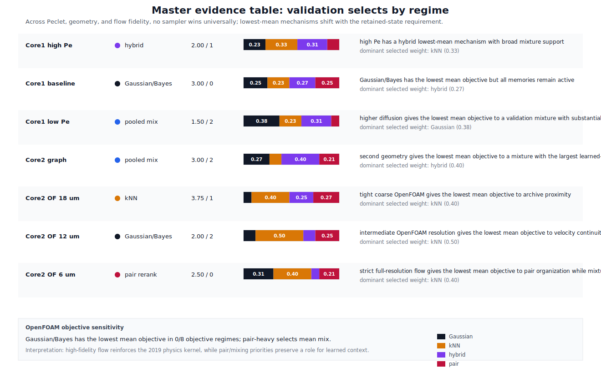

# Master Evidence Table

## Summary

This table collects the current evidence across Peclet regime, geometry, and flow fidelity. It is the compact version of the story we should keep in mind while drafting:

```text
No sampler wins universally.
Peclet regime changes the selected mixture.
OpenFOAM flow preserves velocity memory, but tight validation changes which memory is adequate.
Pair-heavy objectives can still recover velocity or learned context depending on the reference physics.
```

Generated by:

```bash
python3 scripts/make_master_evidence.py
```

Outputs:

```text
outputs/master_evidence_table.json
outputs/master_evidence_table.csv
figures/run_013_master_evidence_matrix.svg
```

## Main Evidence Matrix

```text
condition        best mean sampler          mean_obj  mean_rank  selected weights (G, kNN, H, pair)
Core1 high Pe    pooled_validation_mixture    276.15      2.00   0.438, 0.188, 0.333, 0.042
Core1 baseline   pooled_validation_mixture    121.64      2.00   0.413, 0.150, 0.413, 0.025
Core1 low Pe     hybrid                       243.53      2.50   0.271, 0.000, 0.708, 0.021
Core2 graph      gaussian_bayes               255.40      1.75   0.479, 0.188, 0.271, 0.063
Core2 OF 18 um   knn_conditional             1567.42      2.75   0.167, 0.417, 0.083, 0.333
Core2 OF 12 um   pooled_validation_mixture   1593.69      1.50   0.063, 0.479, 0.125, 0.333
Core2 OF 6 um    pooled_validation_mixture   1695.18      2.50   0.271, 0.417, 0.104, 0.208
```



## OpenFOAM Objective Sensitivity Addendum

Run 020 supersedes the earlier low-count OpenFOAM objective-weight sensitivity layer with tight `dt=0.1`, 5000-particle trajectories:

```text
18 um: archive proximity is best in all objective regimes by mean score.
12 um: validation-selected mixture is best in all objective regimes by mean score.
6 um: validation-selected mixture is best in all regimes except pair-heavy, which selects velocity memory.
```

This is a useful nuance. Higher-fidelity flow preserves the physical value of velocity memory, but validation still decides when that memory is sufficient and when archive or mixture memories are safer.

## OpenFOAM Resolution Addendum

Runs 015--020 add a resolution ladder for the Core2 OpenFOAM voxel-flow case:

```text
case          cells       k (m^2)       corr lag 10  corr lag 80   balanced best        mean obj
18 um         98,270      4.277e-12       0.1099       0.0878       knn_conditional       1567.42
12 um        322,524      3.690e-12       0.1259       0.1019       pooled mixture        1593.69
6 um       2,650,688      3.492e-12       0.1260       0.1043       pooled mixture        1695.18
```

The resolution ladder sharpens the manuscript claim. Higher-resolution OpenFOAM tightens permeability and preserves velocity autocorrelation, while the strict full-resolution convergence check in Run 017 lowers the hydraulic estimate to `3.492e-12 m^2`. The tight balanced benchmarks select archive proximity at 18 um and validation-selected mixtures at 12 and 6 um. Better physics therefore does not eliminate memory selection; it makes the selection question more precise.

## Manuscript Use

This should become either:

- a compact Results table after the Peclet and OpenFOAM subsections, or
- a final synthesis figure before Discussion.

The table supports the central thesis:

```text
TTA-v2 is not a black-box learned replacement for the 2019 method. It is a
validation-driven scaffold that lets physics kernels, learned transition rules,
and mixtures compete under the transport objective that matters.
```
