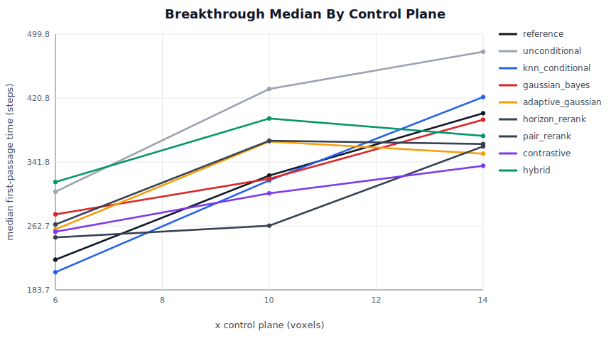
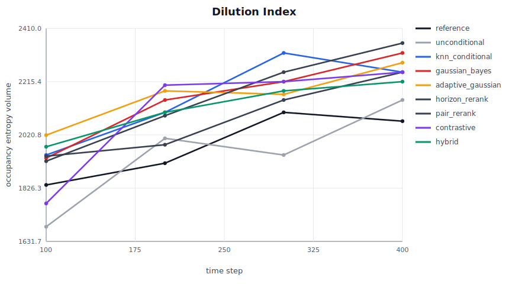
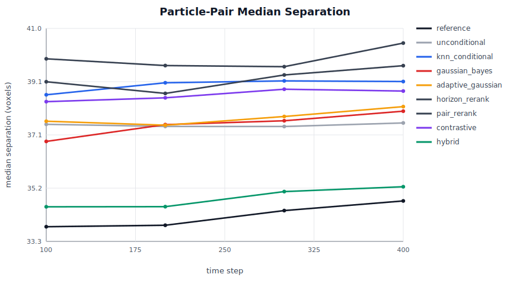
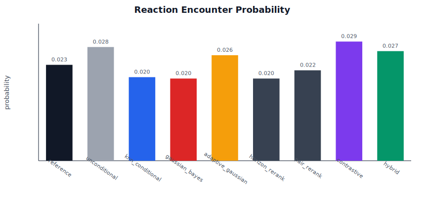
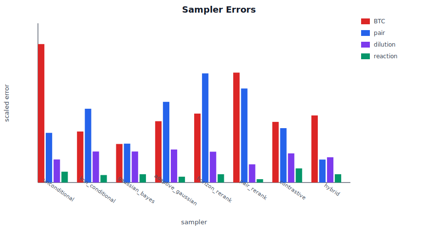

# Run 002: Pair-Aware Reranking

## Summary

This run uses the 6 micrometer Bentheimer sandstone CT volume, block-averaged to a 75^3 bootstrap simulation, then evaluates trajectory samplers against held-out particle trajectories.

- metrics file: `../outputs/bentheimer_6um_downsample3_full_metrics_pair_rerank.json`
- train trajectories: `210`
- reference trajectories: `90`
- archive segments: `6300`
- segment steps: `36`
- match steps: `20`
- planes: `[6.0, 10.0, 14.0]`
- time indices: `[100, 200, 300, 400]`

## Main Result

- Best BTC score: `gaussian_bayes`
- Best pair-separation score: `hybrid`
- Best dilution score: `pair_rerank`

The tuned Gaussian/Bayes kernel remains the strongest overall baseline. The learned and adaptive variants are informative, but they do not yet beat the physics-informed seam kernel on the most transport-specific metrics.

## Metric Table

| sampler | BTC score | dilution log MAE | pair MAE | reaction abs error |
|---|---:|---:|---:|---:|
| gaussian_bayes | 30.87 | 0.083 | 1.56 | 0.003 |
| knn_conditional | 40.88 | 0.083 | 2.95 | 0.003 |
| contrastive | 48.56 | 0.078 | 2.18 | 0.006 |
| adaptive_gaussian | 49.11 | 0.088 | 3.23 | 0.002 |
| hybrid | 53.73 | 0.067 | 0.92 | 0.003 |
| horizon_rerank | 55.23 | 0.082 | 4.37 | 0.003 |
| pair_rerank | 88.05 | 0.049 | 3.77 | 0.001 |
| unconditional | 110.92 | 0.062 | 1.99 | 0.004 |

## Figures

## Interpretation

The old TTA Gaussian/Bayes transition rule is not just a historical baseline; it is a strong inductive bias. The first learned transition models improve isolated metrics in places, but they are too local and can damage pair dynamics. The next useful model should optimize short-horizon or multi-step transport consequences rather than one-step continuation plausibility.
