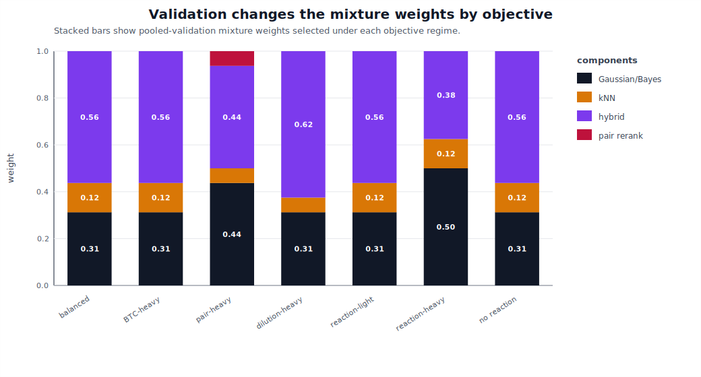
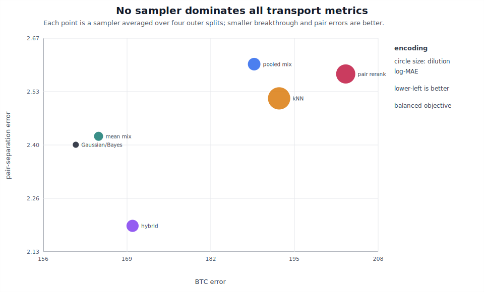

# Run 011: OpenFOAM Objective-Weight Sensitivity

## Summary

Run 011 repeats the objective-weight sensitivity experiment on the Core2 OpenFOAM-derived trajectory set:

```text
data/processed/bentheimer_core2_subvol1_6um_downsample3_D001_openfoam_trajectories.npz
```

This directly tests whether the OpenFOAM result from Run 010 depends on the balanced objective weights.

## Command

```bash
python3 scripts/objective_weight_sensitivity.py \
  --input data/processed/bentheimer_core2_subvol1_6um_downsample3_D001_openfoam_trajectories.npz \
  --n-outer-splits 4 \
  --n-repeats 3 \
  --grid-step 0.25 \
  --n-validation-generated 35 \
  --n-test-generated 60 \
  --pair-samples 1000 \
  --contrastive-epochs 300 \
  --contrastive-negative-ratio 6 \
  --hybrid-learned-weight 0.25 \
  --pair-rerank-weight 0.25 \
  --output outputs/bentheimer_core2_subvol1_6um_downsample3_D001_openfoam_objective_weight_sensitivity.json
```

## Best Mean Sampler By Regime

```text
regime           best_mean_sampler            mean_obj  mean_rank  wins  beats_g  beats_h
balanced         gaussian_bayes                 303.63       1.75     1        0        2
btc_heavy        gaussian_bayes                 554.80       2.00     1        0        2
pair_heavy       hybrid                         281.13       3.00     1        2        0
dilution_heavy   gaussian_bayes                 370.49       2.25     1        0        1
reaction_light   gaussian_bayes                 297.33       2.25     1        0        1
reaction_heavy   gaussian_bayes                 169.32       2.00     2        0        3
no_reaction      gaussian_bayes                 296.63       2.25     1        0        1
```

Gaussian/Bayes remains the best mean sampler in six of seven regimes. The exception is the pair-heavy regime, where the hybrid sampler has the best mean objective and beats Gaussian/Bayes on two of four outer splits.

## Mixture Performance

The bootstrap-mean mixture is more competitive than the pooled-validation mixture in this OpenFOAM sensitivity run:

```text
regime           bootstrap mean_obj  bootstrap wins  bootstrap beats_g  bootstrap beats_h
balanced                    309.07               1                  1                  2
btc_heavy                   566.44               1                  1                  2
pair_heavy                  294.45               1                  2                  2
dilution_heavy              390.47               1                  1                  2
reaction_light              314.17               1                  1                  2
reaction_heavy              173.62               1                  2                  2
no_reaction                 313.55               1                  1                  2
```

The pooled mixture is less stable here. This suggests that repeated-weight averaging can be a useful regularizer when validation samples are small or when generated OpenFOAM trajectories produce sharper split-to-split differences.

## Selected Weights

Pooled-validation mean selected weights:

```text
regime           gaussian  kNN     hybrid  pair
balanced           0.313  0.125    0.563  0.000
btc_heavy          0.313  0.125    0.563  0.000
pair_heavy         0.438  0.063    0.438  0.063
dilution_heavy     0.313  0.063    0.625  0.000
reaction_light     0.313  0.125    0.563  0.000
reaction_heavy     0.500  0.125    0.375  0.000
no_reaction        0.313  0.125    0.563  0.000
```

Bootstrap-mean selected weights:

```text
regime           gaussian  kNN     hybrid  pair
balanced           0.250  0.167    0.542  0.042
btc_heavy          0.250  0.167    0.542  0.042
pair_heavy         0.292  0.229    0.458  0.021
dilution_heavy     0.417  0.146    0.333  0.104
reaction_light     0.208  0.188    0.521  0.083
reaction_heavy     0.417  0.188    0.333  0.063
no_reaction        0.208  0.188    0.521  0.083
```

## Figures






## Interpretation

Run 011 strengthens the central paper framing:

```text
the higher-fidelity OpenFOAM field makes the original Gaussian/Bayes physics
kernel the most stable fixed sampler, but objective priorities and held-out
splits still alter the selected transport mechanism.
```

This is especially clear in the pair-heavy regime, where the hybrid sampler becomes the best mean performer. The result also adds a useful methodological point: pooled validation can be too brittle when each validation ensemble is small, while bootstrap-mean weights provide a more stable mixture summary.

For the manuscript, this belongs in the generalization/high-fidelity section rather than as a separate main result. It supports three claims:

- the original 2019 physics kernel is still scientifically strong,
- pair/mixing objectives can elevate learned transition context,
- validation should select mechanisms under the scientific objective instead of assuming one sampler is universally best.
