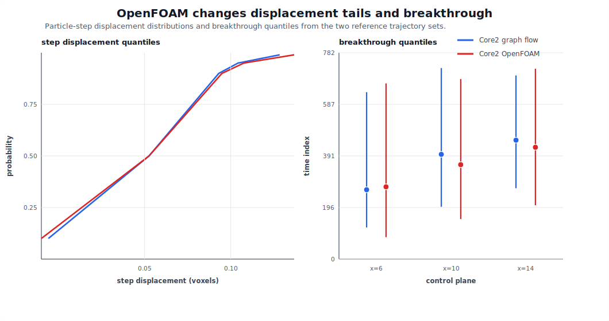
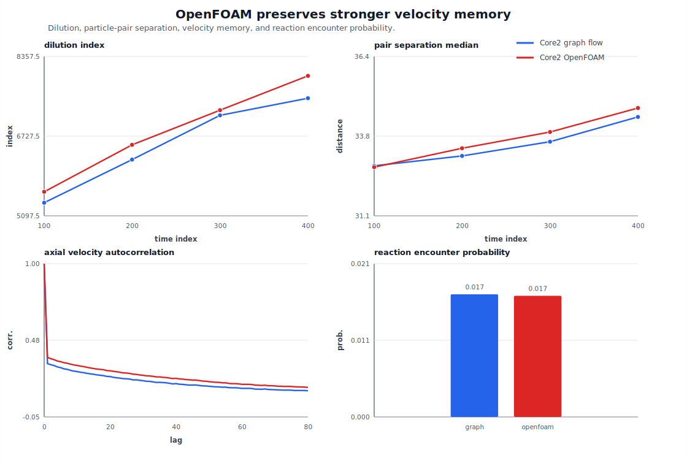

# Run 012: Core2 Graph Flow vs OpenFOAM Physics

## Summary

Run 012 compares the two Core2 reference trajectory sets directly:

```text
graph flow: data/processed/bentheimer_core2_subvol1_6um_downsample3_D001_trajectories.npz
OpenFOAM:   data/processed/bentheimer_core2_subvol1_6um_downsample3_D001_openfoam_trajectories.npz
```

Both sets use the same Core2 geometry, 500 particles, 800 steps, `dt = 0.5`, and `D = 0.001`. The difference is the advective velocity field: the in-house graph-Laplace approximation versus the OpenFOAM finite-volume field.

## Command

```bash
python3 scripts/compare_core2_flow_physics.py
```

Outputs:

```text
outputs/core2_graph_vs_openfoam_physics_comparison.json
figures/run_012_core2_graph_vs_openfoam_btc_speed.svg
figures/run_012_core2_graph_vs_openfoam_mixing_memory.svg
```

## Main Physical Differences

The two trajectory sets are intentionally close in bulk transport scale because both are normalized to the same mean advective speed before particle tracking. Even so, OpenFOAM changes the higher-order physics:

```text
quantity                         graph flow      OpenFOAM
mean step displacement              0.0553         0.0561
median step displacement            0.0519         0.0519
95th percentile displacement        0.1060         0.1111
99th percentile displacement        0.1481         0.1664
max step displacement               0.4452         0.5577
mean axial increment                0.0121         0.0125
final x mean                       10.1531        10.4878
final x q90                        25.4449        27.2591
```

OpenFOAM has a slightly fatter high-displacement tail and slightly larger downstream spread.

## Breakthrough

Using graph flow as the reference, OpenFOAM differs by:

```text
btc_quantile_mae:       36.13 time steps
btc_coverage_deficit:    0.0127
btc_score:              39.30
```

Median breakthrough times:

```text
plane   graph q50   OpenFOAM q50
x=6       263.0        274.0
x=10      397.0        358.0
x=14      451.0        424.0
```

OpenFOAM is not uniformly earlier or later. It is slightly later at the first plane but earlier at the downstream planes, consistent with a broader/fatter transport distribution rather than a simple bulk-speed shift.

## Mixing, Pair Separation, And Reaction

```text
metric                         graph flow       OpenFOAM
dilution at t=100               5365.76          5588.79
dilution at t=400               7502.76          7959.51
pair median at t=100              32.76            32.71
pair median at t=400              34.40            34.70
reaction probability               0.0170           0.0168
```

The reaction proxy is essentially unchanged at this radius and sample size. Dilution is consistently higher under OpenFOAM, and late-time pair separation is slightly larger.

## Velocity Memory

The axial velocity autocorrelation is higher for OpenFOAM at every checked lag:

```text
lag    graph flow    OpenFOAM
1        0.3152       0.3577
2        0.3079       0.3489
5        0.2878       0.3284
10       0.2609       0.3029
20       0.2269       0.2662
40       0.1785       0.2144
80       0.1293       0.1521
```

This is the most useful explanatory bridge to the sampler results. The OpenFOAM field preserves stronger Lagrangian velocity memory, which plausibly makes the original Gaussian/Bayes velocity-continuity kernel more valuable.

## Figures





## Interpretation

Run 012 explains why the OpenFOAM benchmark strengthened Gaussian/Bayes:

```text
OpenFOAM does not radically change bulk displacement or reaction probability,
but it increases velocity persistence and slightly fattens the displacement,
dilution, and late-pair-separation tails.
```

That is exactly the regime where a transition rule based on velocity-continuity and diffusive plausibility should remain hard to beat. The learned hybrid still matters for pair-heavy objectives, but the higher-fidelity flow gives the 2019 physics kernel more useful signal to condition on.
