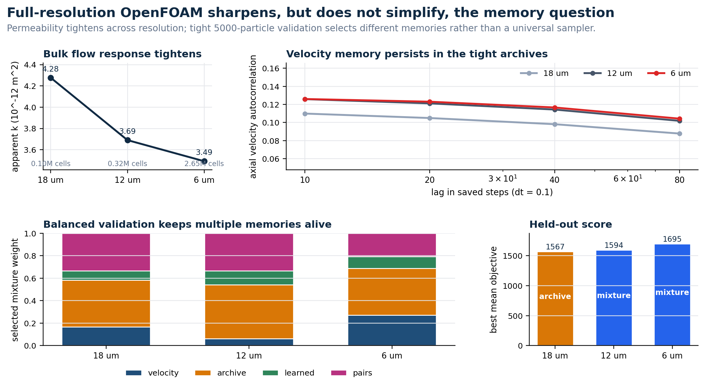

# Run 016: Full-Resolution OpenFOAM Flow

Update: Run 017 repeated the full-resolution flow solve with strict SIMPLE residual controls. The converged permeability is `3.492e-12 m^2`, about `3.3%` below the loose Run 016 value reported below. Runs 018--020 then retracked the OpenFOAM ladder with `5000` particles, tighter time stepping, and updated memory-selection benchmarks. See [Run 017](run_017_strict_openfoam_convergence.md), [Run 018](run_018_strict_particle_tracking.md), [Run 019](run_019_tight_particle_tracking_resolution_ladder.md), and [Run 020](run_020_tight_openfoam_memory_benchmarks.md).

## Purpose

Run 016 pushes the Core2 OpenFOAM validation to the native `225^3` image resolution. The previous OpenFOAM resolution tests used downsample factors 3 and 2, corresponding to `18 um` and `12 um` voxels. Here we use the original `6 um` voxel geometry directly.

This is still a stair-step voxel finite-volume mesh, not a smoothed `snappyHexMesh` or DNS-quality pore surface. Its purpose is narrower and useful: test whether the memory-adequacy story changes when the OpenFOAM velocity field is solved on the least-downsampled pore geometry currently available in the workspace.

## Mesh And Solve

```text
case:       openfoam_cases/bentheimer_core2_subvol1_6um_fullres_voxel_flow
shape:      225 x 225 x 225
voxel size: 6 micrometers
cells:      2,650,688
points:     3,509,487
faces:      8,779,164
```

`checkMesh` passed with `Mesh OK`. The original loose solve stopped under the residual controls then in use:

```text
simpleFoam: SIMPLE solution converged in 215 iterations
OpenFOAM clock time: about 575 seconds
```

Flow summary:

```text
mean speed:              1.802e-08 m/s
median speed:            9.697e-09 m/s
95th percentile speed:   6.309e-08 m/s
maximum speed:           5.648e-07 m/s
outlet flux:             4.875e-15 m^3/s
net boundary flux:       3.948e-20 m^3/s
apparent permeability:   3.611e-12 m^2
```

The stricter Run 017 convergence audit lowers the full-resolution permeability to `3.492e-12 m^2`. The factor-2 case gave `3.690e-12 m^2`, so permeability tightens substantially between `12 um` and `6 um`, although the strict result shows that it was not quite as close as the loose solve suggested. The factor-3 case gave `4.277e-12 m^2`, indicating that the coarsest OpenFOAM voxel field was still too permeable.

## Physical Scaling Choice

The particle tracking was scaled to preserve physical distances relative to the original downsample-factor-3 run:

```text
target mean speed: 0.18 cells / step-unit
diffusivity:       0.009 grid^2 / step-unit
planes:            18, 30, 42 cells
bin size:          9 cells
reaction radius:   9 cells
```

This corresponds to scaling the factor-3 settings by 3 in length and 9 in grid-based diffusivity:

```text
factor-3 target mean speed: 0.06 cells / step-unit
factor-3 diffusivity:       0.001 grid^2 / step-unit
factor-3 planes:            6, 10, 14 cells
```

## Outputs

```text
data/processed/bentheimer_core2_subvol1_6um_fullres_D009_openfoam_phys_scaled_trajectories.npz
outputs/bentheimer_core2_subvol1_6um_fullres_D009_openfoam_phys_scaled_outer_split_mixture_benchmark.json
outputs/bentheimer_core2_subvol1_6um_fullres_D009_openfoam_phys_scaled_objective_weight_sensitivity.json
outputs/openfoam_resolution_ladder_summary.json
figures/run_016_openfoam_resolution_ladder.svg
figures/run_016_openfoam_resolution_ladder.png
```



## Resolution Ladder

```text
case          cells       k (m^2)       corr lag 1   corr lag 80   balanced best        mean obj
18 um         98,270      4.277e-12       0.3577       0.1521       gaussian_bayes        261.39
12 um        322,524      3.690e-12       0.4290       0.1909       gaussian_bayes        286.84
6 um       2,650,688      3.492e-12       0.4215       0.1952       pooled mixture        260.58
```

The velocity autocorrelation result is especially important. Moving from `18 um` to `12 um` strengthens axial velocity memory substantially, and the full-resolution `6 um` case preserves approximately the same elevated memory. The stricter permeability correction makes the hydraulic ladder a little less flat between `12 um` and `6 um`, but the main conclusion survives: the full-resolution trajectory set is not merely a different bulk-speed case; it is a better-resolved case in which velocity memory remains physically meaningful.

## Balanced Outer-Split Benchmark

Full-resolution OpenFOAM result:

```text
sampler                    mean_obj   mean_rank  wins  beats_g  beats_h
pooled_validation_mixture    260.58       1.50     3        4        4
bootstrap_mean_mixture       278.81       3.25     0        2        1
gaussian_bayes               279.72       3.25     0        0        2
hybrid                       279.98       3.00     0        2        0
knn_conditional              305.59       4.00     1        1        1
pair_rerank                  332.37       6.00     0        0        0
```

Mean selected weights:

```text
gaussian_bayes:    0.333
knn_conditional:   0.271
hybrid:            0.292
pair_rerank:       0.104
```

The key result is that the full-resolution balanced benchmark is won by the validation-selected mixture, not by a single fixed memory. Gaussian/Bayes remains strong, but it is not sufficient by itself for the balanced multi-objective target.

## Objective-Weight Sensitivity

Best mean mechanism by regime:

```text
regime           18 um best                 12 um best                 6 um best
balanced         gaussian_bayes             pooled mixture             gaussian_bayes
btc_heavy        gaussian_bayes             hybrid                     pooled mixture
pair_heavy       hybrid                     bootstrap mean mixture     hybrid
dilution_heavy   gaussian_bayes             bootstrap mean mixture     gaussian_bayes
reaction_light   gaussian_bayes             bootstrap mean mixture     gaussian_bayes
reaction_heavy   gaussian_bayes             gaussian_bayes             gaussian_bayes
no_reaction      gaussian_bayes             bootstrap mean mixture     gaussian_bayes
```

The objective-sensitivity sweep used smaller generated ensembles than the primary balanced benchmark, so it should be read as a regime diagnostic rather than a replacement for the balanced outer-split result. Its useful message is still clear: velocity memory remains a strong fixed mechanism at full resolution, while breakthrough-heavy and pair-heavy objectives still expose cases where validation prefers mixture or learned context.

## Interpretation

The full-resolution run changes the story in a good way. It does not overturn the OpenFOAM result that higher-fidelity flow gives velocity memory something real to hold. The autocorrelation ladder supports that claim: `12 um` and `6 um` OpenFOAM trajectories retain much stronger axial velocity memory than the `18 um` case.

But full resolution also prevents the manuscript from making an oversimplified claim. If better flow fidelity simply made Gaussian/Bayes win everywhere, the result would be useful but narrower: a vindication of the original velocity-continuity kernel. Instead, the full-resolution balanced benchmark shows that velocity memory, archive proximity, learned context, and pair organization all receive nonzero validation weight. The more interesting statement is:

```text
Higher-resolution OpenFOAM strengthens velocity memory, but memory adequacy remains
observable-dependent. Better physics does not eliminate the need for validation; it
makes the validation question more precise.
```

This is the story to carry into the manuscript. The old phrasing was that OpenFOAM makes the original Gaussian/Bayes kernel stronger. The stronger phrasing is that OpenFOAM reveals when velocity memory is physically meaningful, while the resolution ladder shows that meaningful velocity memory is not always enough for a multi-objective transport prediction.
